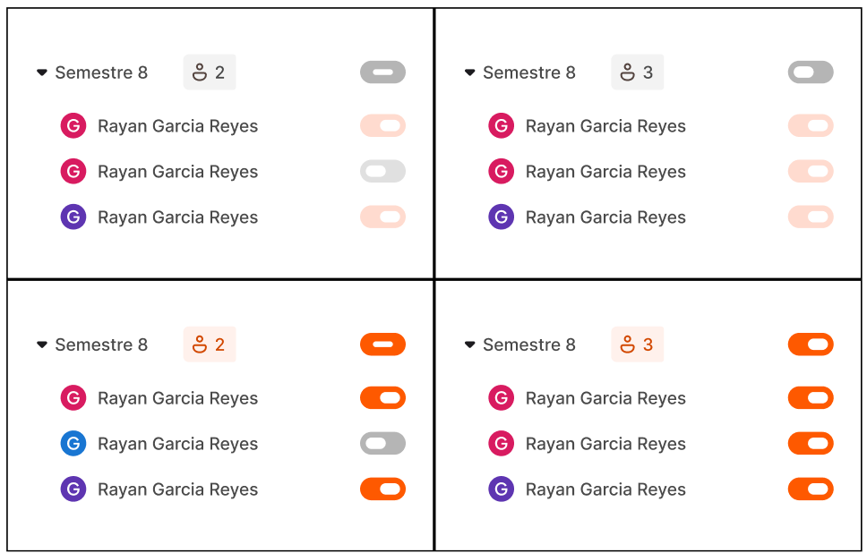

# Toggle UI 仕様


## 1. 概要

このUIでは、親トグルと子トグルに以下の2種類の状態があります。

* **親の有効状態 `isEnable`**
* **各子要素の選択状態 `isSelected`**

重要なのは、`isEnable = false` になっても子要素の `isSelected` はリセットしないことです。

つまり、

```text
親OFF
↓
子の選択状態は保持したまま、子トグルのみ操作不可 / 非活性表示

親ON
↓
以前の子の選択状態をそのまま復元
```

という挙動にします。

---

## 2. 状態モデル

推奨するデータ構造は以下です。

```ts
type GroupState = {
  isEnable: boolean;
  items: {
    id: string;
    isSelected: boolean;
  }[];
};
```

例：

```ts
const group = {
  isEnable: false,
  items: [
    { id: "1", isSelected: true },
    { id: "2", isSelected: false },
    { id: "3", isSelected: true },
  ],
};
```

この状態の場合、親はOFFですが、

```ts
selectedCount === 2
```

です。

親をONにしても、

```ts
{
  isEnable: true,
  items: [
    { id: "1", isSelected: true },
    { id: "2", isSelected: false },
    { id: "3", isSelected: true },
  ],
}
```

となり、子の選択状態は変わりません。

---

# 3. トグルの4つの表示状態

子トグルの表示は

```ts
isEnable × isSelected
```

の組み合わせによって決定します。

| `isEnable` | `isSelected` | 表示状態      | 意味            |
| ---------- | ------------ | --------- | ------------- |
| `true`     | `false`      | 通常グレー OFF | 親が有効 / 子は未選択  |
| `true`     | `true`       | オレンジ ON   | 親が有効 / 子は選択済み |
| `false`    | `false`      | 薄いグレー OFF | 親が無効 / 子は未選択  |
| `false`    | `true`       | 薄いオレンジ ON | 親が無効 / 子は選択済み |

ここで重要なのは、

> `isEnable = false && isSelected = true`

を単純な「OFF」として扱わないことです。

これは、

**「現在は無効だが、選択状態そのものは保持されている」**

状態です。

---

# 4. 親トグル

親トグルはグループ全体の

```ts
isEnable
```

を変更します。

### OFF → ON

```ts
isEnable = true;
```

子要素の `isSelected` は変更しません。

```text
Before

Parent OFF
├─ Child A selected
├─ Child B unselected
└─ Child C selected

        ↓ Parent ON

After

Parent ON
├─ Child A selected
├─ Child B unselected
└─ Child C selected
```

画像でいう左列の、

```text
上
○ Parent
● Child
○ Child
● Child

↓

下
● Parent
● Child
○ Child
● Child
```

の関係です。

---

## 5. 親をOFFにした場合

親をOFFにした場合も、

```ts
isEnable = false;
```

だけを変更します。

以下の処理は**行いません**。

```ts
items.forEach(item => {
  item.isSelected = false; // NG
});
```

つまり、

```ts
// OK
setGroup(prev => ({
  ...prev,
  isEnable: false,
}));
```

とします。

これによって再度ONにした際に選択状態を復元できます。

---

# 6. 子トグル

子トグルは、

```ts
item.isSelected
```

のみを変更します。

ただし、

```ts
isEnable === false
```

の場合は操作できません。

```ts
const handleChildToggle = (id: string) => {
  if (!group.isEnable) return;

  // isSelected を反転
};
```

したがって、

```text
Parent ON
→ Child toggle clickable

Parent OFF
→ Child toggle disabled
```

です。

ただし、disabledになっても現在の `isSelected` は表示します。

---

# 7. 選択件数

親ラベル横の数値は、

```ts
items.filter(item => item.isSelected).length
```

で算出します。

```ts
const selectedCount = items.filter(
  item => item.isSelected
).length;
```

`isEnable` は件数計算に影響しません。

例えば、

```ts
isEnable = false

[
  { isSelected: true },
  { isSelected: false },
  { isSelected: true }
]
```

であっても、

```text
2
```

と表示します。

これは添付デザインの、

```text
Parent OFF   [2]

Child A  selected
Child B  unselected
Child C  selected
```

という状態に対応します。

---

# 8. 全選択状態も同じ考え方

3件すべてが選択されている場合、

```ts
[
  { isSelected: true },
  { isSelected: true },
  { isSelected: true },
]
```

親OFFでは、

```text
Parent OFF   [3]

Child A  薄いオレンジ
Child B  薄いオレンジ
Child C  薄いオレンジ
```

親ONでは、

```text
Parent ON   [3]

Child A  オレンジ
Child B  オレンジ
Child C  オレンジ
```

となります。

つまり親トグルは、

**「子の選択/未選択を一括変更するスイッチ」ではなく、「現在保持している子設定を有効にするスイッチ」**

です。

ここは実装上かなり重要です。

---

# 9. `isMulti` について

添付の状態表では、

```ts
isMulti = true
isMulti = false
```

でトグルの色・ON/OFF表現自体は変化しません。

したがってUIスタイルについては、

```ts
isMulti
```

を判定材料にする必要はありません。

表示状態は基本的に、

```ts
getToggleVisualState({
  isEnable,
  isSelected,
});
```

だけで決定できます。

例えば、

```ts
type ToggleProps = {
  isMulti: boolean;
  isEnable: boolean;
  isSelected: boolean;
};
```

であったとしても、

```ts
const visualState =
  isSelected
    ? isEnable
      ? "selected"
      : "selected-disabled"
    : isEnable
      ? "unselected"
      : "unselected-disabled";
```

となります。

`isMulti` は、必要であれば**コンポーネントの役割や操作ロジックを区別するための値**として使用し、色の決定とは分離します。

---

# 10. 状態遷移表

エンジニア向けには、以下の状態遷移を仕様として明記しておくと安全です。

| 操作           | `isEnable` | 子 `isSelected` |
| ------------ | ---------: | -------------- |
| 親をON         |     `true` | **変更しない**      |
| 親をOFF        |    `false` | **変更しない**      |
| 子をON         |      変更しない | `true`         |
| 子をOFF        |      変更しない | `false`        |
| 親OFF中に子をクリック |       変更なし | **変更なし**       |

---

# 11. React実装イメージ

```tsx
<Group>
  <ParentToggle
    checked={group.isEnable}
    onCheckedChange={handleEnableChange}
  />

  {group.items.map(item => (
    <ChildToggle
      key={item.id}
      checked={item.isSelected}
      disabled={!group.isEnable}
      isEnable={group.isEnable}
      onCheckedChange={() => handleItemChange(item.id)}
    />
  ))}
</Group>
```

ロジック：

```ts
const handleEnableChange = (isEnable: boolean) => {
  setGroup(prev => ({
    ...prev,
    isEnable,
  }));
};

const handleItemChange = (id: string) => {
  setGroup(prev => {
    if (!prev.isEnable) {
      return prev;
    }

    return {
      ...prev,
      items: prev.items.map(item =>
        item.id === id
          ? {
              ...item,
              isSelected: !item.isSelected,
            }
          : item
      ),
    };
  });
};
```

---

# 12. UI状態を命名する場合

実装ではbooleanをCSS側まで直接持ち込むより、4状態に変換してしまうのも分かりやすいです。

```ts
type ToggleVisualState =
  | "unselected"
  | "selected"
  | "disabled-unselected"
  | "disabled-selected";
```

変換：

```ts
function getToggleVisualState(
  isEnable: boolean,
  isSelected: boolean
): ToggleVisualState {
  if (!isEnable) {
    return isSelected
      ? "disabled-selected"
      : "disabled-unselected";
  }

  return isSelected
    ? "selected"
    : "unselected";
}
```

対応関係は、

```text
enabled + unselected
→ gray

enabled + selected
→ orange

disabled + unselected
→ light gray

disabled + selected
→ light orange
```

です。

---

## 実装仕様として最も重要なポイント

> **`isEnable` と `isSelected` は独立した状態として管理する。**
>
> 親トグルをOFFにしても子の `isSelected` を変更しない。
> 親OFF時は子を非活性表示・操作不可とするが、選択済みかどうかは視覚的に残す。
> 親を再度ONにした場合、OFFにする前の子の選択状態がそのまま復元される。

この設計にしておくと、添付の**左上 ↔ 左下、右上 ↔ 右下の4パターンを1つの状態モデルで自然に表現できます**。
